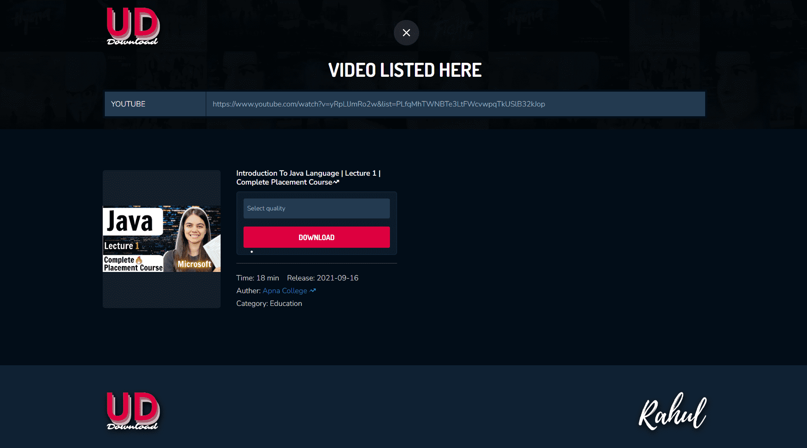
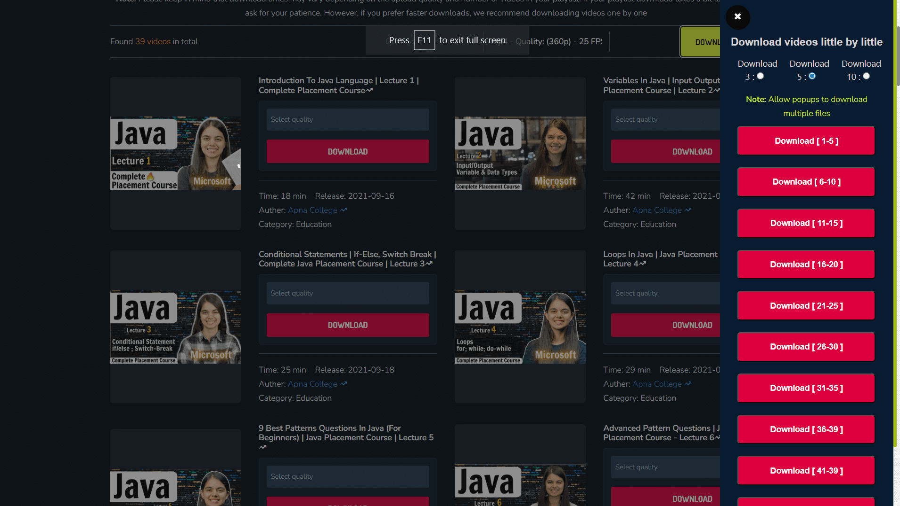

# UDownload ⚡[Live](https://udownload.netlify.app/)

> **Note**
> The code is private. Please contact me on [WhatsApp](https://rkpassin132.github.io) if you require access to it.

> **Warning**
>  Please note that the website's performance may be affected due to the utilization of a free server, which could result in slower loading speeds.

## Introduction


### Looking to download videos or playlists from YouTube, YouTube Music, or YouTube Kids?

Look no further than UDownload! With our easy-to-use website, you can simply paste the video or playlist URL and start downloading in no time. Say goodbye to complicated software and hello to hassle-free downloading. Try UDownload today!

## Compatibility:

| Android Version         |     Supported |
| :---------------------- | ------------: |
| Android 6.0 Marshmallow | Yes or Higher |
| Windows xp              | Yes or Higher |
| Linux                   |           Yes |
| Apple                   |           Yes |

## Code at a glance

The table below shows the platform features used in the application and where abouts to find them in the sample.

### Frameworks

| Framework                                                     | Usage               |
| :------------------------------------------------------------ | :------------------ |
| [React](https://legacy.reactjs.org/docs/getting-started.html) | React for front-end |

### Libraries

| Library                                          | Usage                                                                                |
| :----------------------------------------------- | :----------------------------------------------------------------------------------- |
| [native-redux](https://react-redux.js.org/)      | To maintain and update data across your applications                                 |
| [@reduxjs/toolkit](https://reactnavigation.org/) | For efficient Redux development                                                      |
| [axios](https://www.npmjs.com/package/axios)     | For api calls                                                                        |
| [Node.js](https://nodejs.org/en/)                | Api development in node.js. [Github](https://github.com/rkpassin132/book-reader-api) |

### App features [(more image)](images/)

| Features                                                                                                                                               |
| :----------------------------------------------------------------------------------------------------------------------------------------------------- |
| To download a video, please paste the URL of the desired video, select the preferred quality (MP3 or MP4), and click on the download button.           |
| [](images/download-1-video.png)                                           |
| To download a playlist, please paste the URL of the desired playlist, select the preferred quality (MP3 or MP4), and click on the Download All button. |
| [](images/download-playlist.png)                                        |
| To customize the number of videos you can download simultaneously, this feature also displays the range of episodes you are currently downloading.     |
| [](images/download-playlist-videos.png)                   |

## Some commands

```shell
$ npm start # local run
$ npm run build # build project to deploy
```
